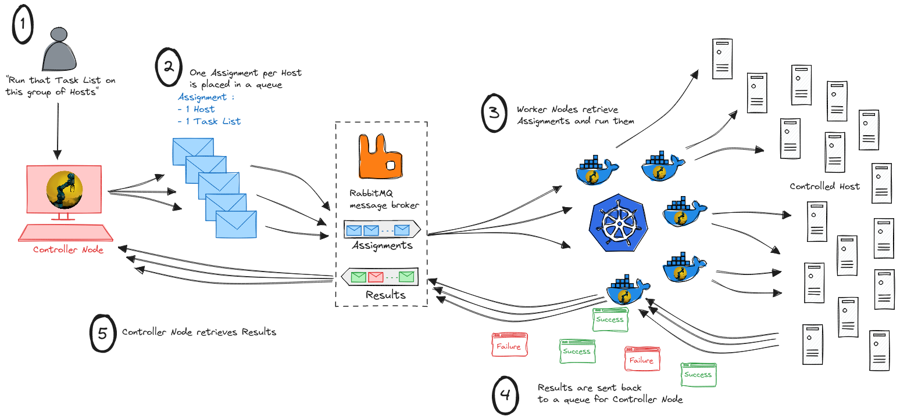

# Dux : scalable worker implementation

# The goal
Instead of having one big automation tool (meaning configuration management or orchestration tool) trying to handle all scenarios (be scalable, performant, handle local and remote hosts through this protocol or this one, be compliant with this security standard and this one...), we prefer to build one flexible automation *engine* (the [duxcore](https://crates.io/crates/duxcore) crate) and make it as easy as possible to embed in a codebase already adapted to one's specific need.

This repository contains one implementation example : the scalable worker version. This binary fetches assignments from a [controller](https://gitlab.com/dux-tool/dux-scalable-controller) through a RabbitMQ instance, run them and send back the results still through RabbitMQ. The use of a message broker in between what generates assignments and what run them allows to scale the system.

# Usage
~~~
placeholder
~~~

*with `tasklist.yaml`*
~~~
---
placeholder
~~~

**Output example**
placeholder (logs)

## Want to contribute or just talk about this project ?
Open to suggestions, feedback, requests and any contribution ! Will gladly exchange ideas with you right [there](https://discord.com/invite/2gxAW7uzsx) !

# License
Licensed under the Apache License, Version 2.0 (the "License");
you may not use this file except in compliance with the License.
You may obtain a copy of the License at

[http://www.apache.org/licenses/LICENSE-2.0](http://www.apache.org/licenses/LICENSE-2.0)

Unless required by applicable law or agreed to in writing, software
distributed under the License is distributed on an "AS IS" BASIS,
WITHOUT WARRANTIES OR CONDITIONS OF ANY KIND, either express or implied.
See the License for the specific language governing permissions and
limitations under the License.

# Todo list
- [ ] introduce end-to-end encryption [(Ockam ?)](https://github.com/build-trust/ockam)
- [ ] add unit tests and integration tests
- [ ] create Docker image to allow scaling it
